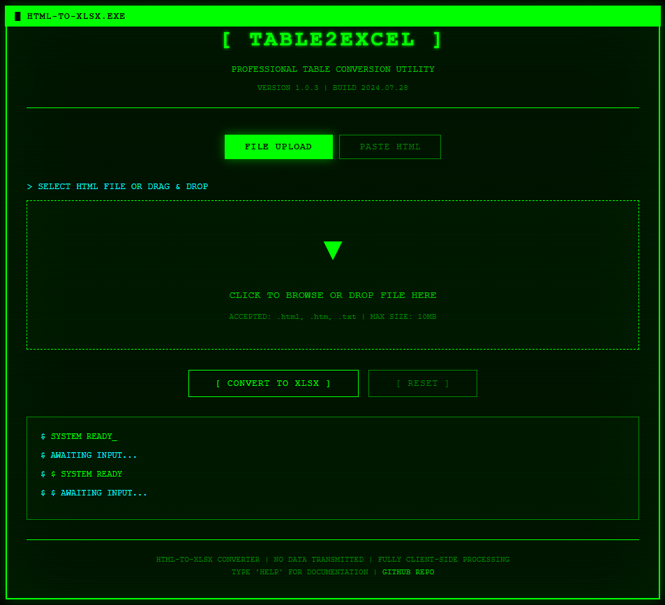

# HTML-to-XLSX Converter



**Professional Table Conversion Utility**  
Version 2.1.3 | Build 2024.07.28

## Overview

A retro-styled, professional HTML table to Excel converter with a distinctive MS-DOS terminal aesthetic. Convert HTML tables to XLSX format entirely in your browser with zero server transmission - all processing happens client-side for complete privacy.

## Features

### Dual Input Methods
- **File Upload**: Drag & drop or browse for HTML files (.html, .htm, .txt)
- **Direct Paste**: Paste raw HTML code directly into the application

### Advanced HTML Processing
- ✓ Multiple tables detection and selection
- ✓ Colspan and rowspan support (merged cells)
- ✓ Nested table handling
- ✓ Malformed HTML recovery
- ✓ Unicode and special character support
- ✓ Automatic table detection from full HTML documents

### Professional Output
- XLSX format (Excel 2007+)
- Preserves table structure with merged cells
- Multiple sheets for multiple tables
- UTF-8 encoding for international characters
- Auto-generated or custom sheet names from table captions

### Retro-Professional Design
- MS-DOS terminal-inspired interface
- High-contrast green-on-black color scheme
- Monospace typography throughout
- Scanline effects and text glow
- Fully responsive layout

## Usage

### Method 1: File Upload
1. Open `index.html` in your browser
2. Click "FILE UPLOAD" (default mode)
3. Drag & drop an HTML file or click to browse
4. Review detected tables
5. Click "CONVERT TO XLSX"
6. Download your converted file

### Method 2: Paste HTML
1. Open `index.html` in your browser
2. Click "PASTE HTML" button
3. Paste your HTML code into the textarea
4. Review detected tables
5. Click "CONVERT TO XLSX"
6. Download your converted file

### Multiple Tables
When multiple tables are detected, you can:
- Select which tables to include in the conversion
- Each table becomes a separate sheet in the Excel file
- Sheet names are derived from table captions or IDs

## Technical Details

### Client-Side Processing
- All conversion happens in your browser
- No data sent to any server
- Complete privacy and security
- Works offline after initial load

### Technologies Used
- **SheetJS (xlsx)**: XLSX file generation
- **DOMParser API**: HTML parsing
- **FileReader API**: File upload handling
- **Vanilla JavaScript**: No framework dependencies
- **Pure CSS**: Custom retro styling

### Browser Compatibility
- Chrome (latest 2 versions)
- Firefox (latest 2 versions)
- Safari (latest 2 versions)
- Edge (latest 2 versions)

### File Limits
- Maximum file size: 10MB
- Maximum paste length: 5,000,000 characters
- No practical limit on table size (browser memory dependent)

## File Structure

```
HTML-to-XLSX/
├── index.html          # Main application page
├── css/
│   └── style.css       # Retro-professional styling
├── js/
│   └── script.js       # Application logic
├── test_simple.html    # Test file: simple table
├── test_complex.html   # Test file: merged cells
├── test_multiple.html  # Test file: multiple tables
└── README.md           # This file
```

## Testing

Three test files are included:

1. **test_simple.html**: Basic table with headers and data
2. **test_complex.html**: Table with colspan and rowspan
3. **test_multiple.html**: Document with multiple tables

Use these to verify functionality after setup.

## Features Roadmap

Potential future enhancements:
- CSV output format
- Table preview before conversion
- Custom column filtering
- Batch file processing
- Style preservation options
- Command-line interface mode

## Privacy & Security

- ✓ 100% client-side processing
- ✓ No data transmission to servers
- ✓ No cookies or tracking
- ✓ No external API calls (except CDN for SheetJS)
- ✓ Works completely offline

## License

Open source - free to use and modify.

## Credits

Built with SheetJS Community Edition  
Retro design inspired by classic MS-DOS interfaces

---

**TYPE 'HELP' FOR DOCUMENTATION**  
**SYSTEM READY_**